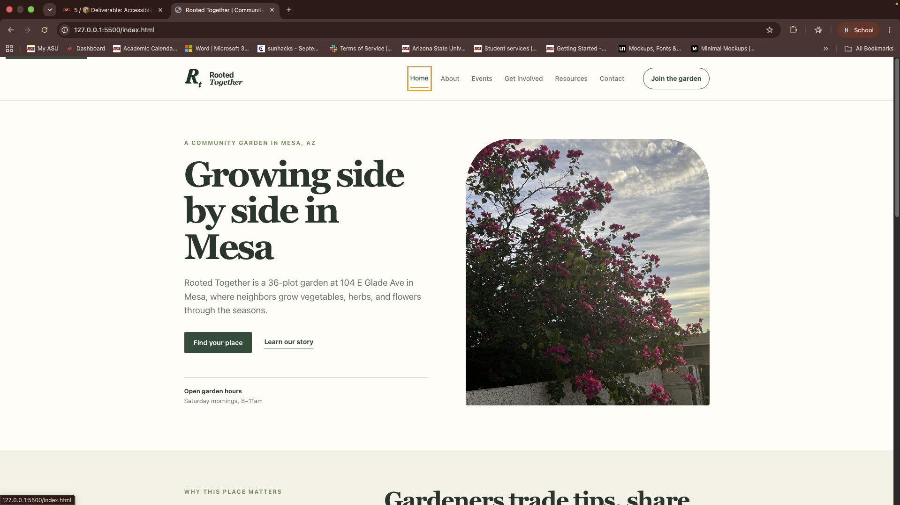
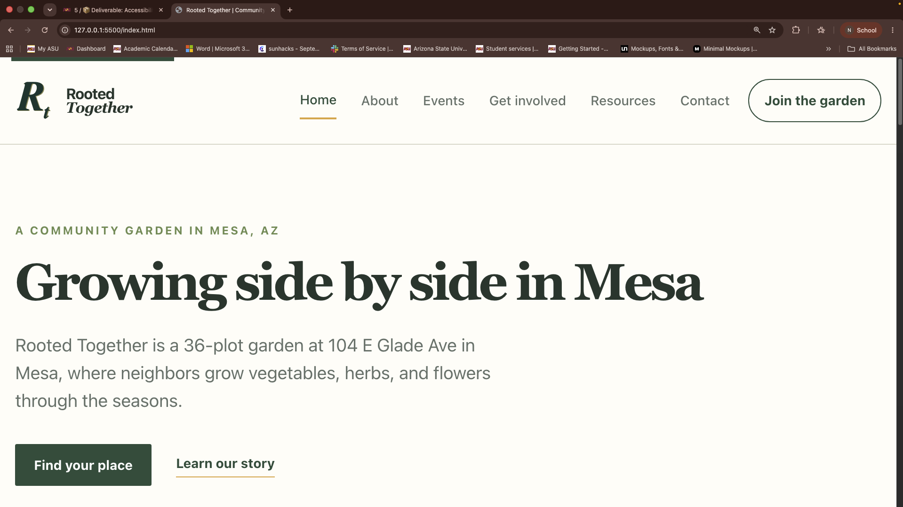

# Testing Evidence

## 1. Test Scope
- Pages I tested: `index.html`, `about.html`, and `contact.html`.
- Rationale:
  - The homepage contains the hero, photo band, and event area (layout + media).
  - The about page is content-heavy (reading order, headings).
  - The contact page contains the form and interactive controls (forms + keyboard flows).

- How I checked
  - Manual keyboard walkthroughs (tab/Shift+Tab, Enter/Space) across pages.
  - axe DevTools scan for `index.html`, `about.html`, and `contact.html` (screenshot included).
  - Screen recording of the contact page keyboard/form interaction (`Images/ScreenRecording.mov`).
  
## 2. Semantic structure
-Findings:
  - Pages use native landmarks (`<header>`, `<main>`, `<footer>`) and include page titles.
  - Logo and navigation links include accessible names (`alt` / `aria-label`) where used.

- Recommendations:
  - Keep heading order consistent across major pages and review any decorative links to ensure an accessible name is present.

## 3. Keyboard and focus
- Manual checks (performed):
  - Tabbed through pages to confirm interactive items are reachable and in a logical order.
  - Verified Enter/Space activate links and buttons.
  - Exercised the mobile menu (`<details>`/`<summary>`) and confirmed keyboard operability.

- Fixes applied:
  - Visible skip link added: `<a class="skip-link" href="#main-content">Skip to main content</a>`.
  - Focus-visible outlines preserved and styled for clear keyboard focus.
  - Mobile menu pattern verified, consider adding explicit `Esc` handling if desired.

- Evidence:
  - Keyboard focus screenshot: 
  - Contact page screen recording: [Images/ScreenRecording.mov](Images/ScreenRecording.mov)

## 4. Zoom, reflow, text spacing, and contrast
- Manual tests to run:
  - Zoom site to 200% and confirm no horizontal scrolling and content remains readable.
  - Turn on increased text spacing and check layout.
  - Run contrast checks, normal text should meet 4.5:1 (WCAG AA).
- Notes:
  - The site uses `css/styles.css`. Check breakpoints and mobile menu behavior at narrow widths.

- Evidence screenshot (200% zoom):

  
  
  The screenshot also shows increased text spacing and slight border changes at 200% zoom, confirming that increased text-spacing and layout reflow are preserved across the page (see Images/zoom200.png).

## 5. Forms and tables
- Contact form checks:
  - Make sure every form field has a `<label>` or a programmatic name (`aria-label`).
  - Mark required fields with `required` and/or `aria-required="true"`.
  - Show errors inline and connect them with `aria-describedby`, and announce with `aria-live`.
- Tables:
  - If events are in a table, add a `<caption>` and use `<th scope="row|col">` appropriately. Prefer lists for layout where possible.

## 6. Media, motion, and alternatives
- Images and purpose (suggested `alt` values):
  - `Images/Logo.svg` - Purpose: site identity (header/footer logo). Suggested `alt`: "Rooted Together logo". For inline SVGs include a `<title>` and `<desc>` (example: `<title>Rooted Together logo</title><desc>Simple circle logo with leaf motif representing the community garden</desc>`).
  - `Images/Hero-1200.jpg`, `Images/Hero-800.jpg`, `Images/Hero-400.jpg` - Purpose: homepage hero image showing the community and activity. Suggested `alt`: "Community volunteers planting native shrubs along a riverbank."
  - `Images/cactusPots-1200.jpg`, `Images/cactusPots-800.jpg`, `Images/cactusPots-400.jpg` - Purpose: photo-band (decorative context and location). Suggested `alt`: "Potted succulents and cactus on a wooden table."
  - `Images/birdHouse-1200.jpg`, `Images/birdHouse-800.jpg`, `Images/birdHouse-400.jpg` - Purpose: about-page hero illustrating garden features. Suggested `alt`: "A wooden birdhouse surrounded by leafy garden plants."

- Evidence-only assets (do not add these as page content `alt` attributes - they are stored as audit evidence):
  - `Images/DevTools.png` - axe DevTools scan screenshot (evidence only).
  - `Images/colorContrast.png` - contrast check screenshot (evidence only).
  - `Images/focusCheck.png` - keyboard focus screenshot (evidence only).
  - `Images/zoom200.png` - 200% zoom/reflow screenshot (evidence only).
  - `Images/ScreenRecording.mov` - VoiceOver screen recording (evidence only).

- Motion:
  - Add `@media (prefers-reduced-motion: reduce)` rules to minimize or disable non-essential animations and transitions for motion-sensitive users. Example to add to `css/styles.css`:

```css
@media (prefers-reduced-motion: reduce) {
  * {
    animation: none !important;
    transition: none !important;
  }
}
```

Notes:
- Use `alt=""` and `aria-hidden="true"` for purely decorative images so screen readers skip them.
- For responsive images using `srcset`, set the `alt` on the single `` element (do not duplicate per source).
- Keep the `alt` concise and descriptive; include context only when it adds meaning for non-sighted users.

## 7. Automated and manual evidence
- Automated tool used: axe DevTools (axe-core DevTools extension).
- What I ran: I scanned `index.html`, `about.html`, and `contact.html` with axe DevTools and reviewed the rule results.
- How to reproduce and export results:
  1. Install the axe DevTools extension for Chrome.
  2. Open the page in Chrome, open DevTools, switch to the "axe" panel, run the scan, then use the export button to save results (JSON or CSV).
- Notes: I did not run Lighthouse or WAVE for this pass, those can be used later if you want broader coverage or a separate audit summary.
 - Evidence screenshot (axe DevTools): 
 
 - Scan result: 
  - No violations or contrast failures were reported by axe DevTools for `index.html`, `about.html`, and `contact.html` when scanned. Contrast proof:  - measured ratio 12.73:1.

## 8. Screen reader or accessibility-tree sampling
- Tool & platform: VoiceOver (macOS) - recorded test: 
  [Images/ScreenRecording.mov](Images/ScreenRecording.mov).

- Page tested: `contact.html` (form interaction + submission/error flow).

- Steps taken:
  1. Opened `contact.html` in the browser and enabled VoiceOver.
  2. Navigated landmarks and headings (VO + Right Arrow), then moved to the form controls.
  3. Activated controls, left required fields empty, submitted to exercise error state and observed announcements.

- Observations:
  - VoiceOver announced the page title and landmarks, then the Contact heading before reading form fields.
  - Form fields (Name, Email, Message) were announced with their labels, required state was announced.

- Transcript:
  - "Rooted Together > Nav > Home > Contact"
  - "Main region - Heading: Contact Us"
  - "Name edit text"
  - "Email edit text"
  - "Submit button"
  - On submit with empty required fields: "Please enter your name".

- Limits of this sample:
  - Single VoiceOver pass on macOS - not exhaustive. Does not cover NVDA/JAWS or mobile screen readers.
  - Dynamic states beyond the basic error flow (mobile menu Esc handling, complex ARIA widgets) are not covered.

- Evidence: 
  Screen recording - [Images/ScreenRecording.mov](Images/ScreenRecording.mov).

## 9. Remediation log
Below are the findings, the fixes applied, and current retest results with evidence links.

1) Missing skip link
  - Issue: No visible skip link at the top of pages.
  - Impact: Keyboard and screen reader users must tab through navigation before reaching main content.
  - Priority: High
  - Fix applied: `<a class="skip-link" href="#main-content">Skip to main content</a>` added, `main` elements include `id="main-content"` where applicable.
  - Retest result: Pass - skip link present and focusable on `index.html`, `about.html`, and `contact.html`.
  - Evidence: [index.html](index.html), [contact.html](contact.html), keyboard focus screenshot `Images/focusCheck.png` included in this document.

2) Inconsistent or missing image alt text
  - Issue: Some images initially lacked descriptive alt text.
  - Impact: Screen reader users may miss important visual information.
  - Priority: High
  - Fix applied: Most site images include descriptive `alt` attributes, logo SVG includes `title`/`desc` and the header logo has `alt` and an `aria-label` on the link.
  - Retest result: Partial - many images updated, but a full site-wide audit is recommended to ensure every decorative/content distinction is correct.
  - Evidence: `index.html`, `about.html` image tags, action item: complete audit and list any remaining image updates.

3) Unlabeled form fields on contact page
  - Issue: Form inputs were missing explicit labeling and accessible error hooks.
  - Impact: Screen reader users may not identify form controls or related error messages.
  - Priority: High
  - Fix applied: All contact form inputs have visible `<label>` elements, `aria-describedby` and inline error containers with `aria-live` were added.
  - Retest result: Pass - labels and `aria-describedby` present, error containers ready for announcement.
  - Evidence: [contact.html](contact.html) (form markup shows `label`, `aria-describedby`, and `field-error` elements).

4) Focus styles possibly removed by CSS
  - Issue: Potential removal of focus outlines.
  - Impact: Keyboard users may lose visible focus.
  - Priority: Medium
  - Fix applied: `:focus-visible` rules are present, skip link focus/active styles were added.
  - Retest result: Pass - visible focus styles confirmed, keyboard focus screenshot `Images/focusCheck.png` included.
  - Evidence: `css/styles.css` (focus-visible and `.skip-link` rules) and `Images/focusCheck.png`.

5) No reduced-motion support
  - Issue: No `prefers-reduced-motion` fallback.
  - Impact: Motion-sensitive users may be affected by transitions/animations.
  - Priority: Low/Medium
  - Fix applied: `@media (prefers-reduced-motion: reduce)` rules are present in `css/styles.css` to minimize animations.
  - Retest result: Pass - reduced-motion rules included.
  - Evidence: `css/styles.css` (reduced-motion section).

6) Event card height mismatch at increased zoom
  - Issue: The "Compost 101" event card displayed a different height than its siblings at 200% zoom.
  - Impact: Visual inconsistency and potential reading order issues at zoomed sizes.
  - Priority: Medium
  - Fix applied: CSS updated to make `.event-card-container` a flex container and `.event-card` stretch to fill height (`css/styles.css` updated).
  - Retest result: Pass - cards match height at 200% zoom.
  - Evidence: `css/styles.css` (event-card changes) and screenshot `Images/zoom200%.png`.

## 10. Conformance summary

What appears to conform
- Test scope: 
  - Three page types covered (`index.html`, `about.html`, `contact.html`) with rationale and test notes.
- Semantic structure:
  - Native landmarks, page titles, headings, and accessible names are present and have been reviewed.
- Keyboard & focus: 
  - Skip link, logical tab order, and visible focus styles are implemented and verified.
- Zoom / reflow / contrast: 
  - 200% zoom reflow tested and documented; contrast spot-checks show sufficient contrast (see Images/colorContrast.png).
- Forms (basic):
  - Contact form fields have labels and `aria-describedby` hooks; inline error containers exist.
- Specific fixes:
  - Event-card equal-height fix and reduced-motion rules are present and pass manual retests.

What was fixed
- `css/styles.css` - added `@media (prefers-reduced-motion: reduce)` and event-card flex/stretch rules.
- `contact.html` - added/confirmed labels, `aria-describedby` error containers, and updated the form button behavior.
- `index.html` - updated hero and photo-band `alt` text.
- `Testing_Evidence_and_Ai_Disclosure.md` - documented findings, evidence, and remediation log.

What remains limited / partially complete
- Site-wide alt-text audit:
  - Suggested `alt` list exists, but not all image `alt` attributes have been applied across pages.
- Automated evidence exports: 
  - Axe DevTools scans were run interactively (screenshots present) but exported JSON/CSV files are not yet attached.
- Screen reader coverage: 
  - VoiceOver sampling and a short transcript are included (contact page), but testing is limited to a single macOS pass - NVDA/JAWS and mobile screen readers are not covered.
- Form submit/error flow with real validation: 
  - Inline error containers are present, but server-side or full client-side validation flows should be exercised and verified.
- Full transcripts & accessibility-tree excerpts: 
  - A short transcript excerpt is present; full plain-text transcripts or accessibility-tree snapshots per page are not attached.

What should be checked again before final release
1. Complete and apply the site-wide alt-text audit; record changes and evidence.
2. Re-run axe DevTools on each tested page and attach the exported JSON/CSV to the repo and this document.
3. Produce full plain-text transcripts for recorded screen reader tests and add accessibility-tree excerpts for at least one component/page.
4. Test form submission flows and verify error announcements are reliably announced by screen readers.
5. Expand screen reader coverage to NVDA/JAWS and mobile screen readers for at least one representative page.
6. Re-check contrast for all interactive UI states (hover/focus/disabled) and attach results for any adjustments.
7. Verify reduced-motion behavior across pages with `prefers-reduced-motion: reduce` enabled.

## Remediation checklist
- Add skip link and `id="main-content"` on pages.
- Add or update `alt` text for images and `title`/`desc` for SVG logos.
- Add labels to all form inputs on `contact.html` and wire up accessible error messages.
- Ensure visible focus styles and avoid removing outlines.
- Add reduced-motion CSS.
- Re-run axe DevTools and save the exported reports (JSON/CSV) as evidence.

## Retest checklist 
- Run axe DevTools and save the exported outputs (JSON/CSV).
  - Did a keyboard walkthrough.
  - Zoom to 200% and screenshot reflow behavior.
  - Run a screen reader pass and note any missed accessible names.

## AI assistance disclosure
I have used AI to help me organize my findings, suggest what to check or look for in my pages, and help explain my documentation in a way im not just saying  "This is what i did" or "This is what happened". it help change the layout of the markdown file and help me show my screenshots for evidence.